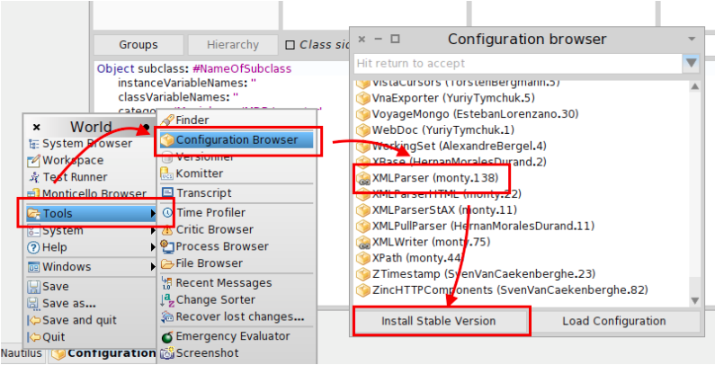

Promoción Objetos 2 - 2015
==========================

El trabajo de promoción consiste de 3 etapas que se desarrollarán durante las
actividades prácticas. Se deben aprobar las 3 etapas para luego, realizar un
trabajo adicional y así finalmente promocionar el final. El trabajo debe ser
realizado en forma individual o en grupos de 2 personas. La entrega se hace en
forma presencial, en un turno de consulta en máquina, en donde el alumno debe
mostrar la solución al docente y el mismo puede hacer consultas y requerir que
implementen pequeños cambios.

A lo largo del proyecto de promoción Ud. trabajará sobre una aplicación que
maneja datos de películas, usuarios que vieron esas películas y el rating que le
asignaron. Importante: debe utilizar Pharo 4 para realizar este trabajo.

La cátedra provee los siguientes elementos de trabajo:

1. Código Smalltalk con un modelo inicial de objetos del dominio. Instale
   evaluando la siguiente expresión en un workspace:

  ```smalltalk
      Gofer new
            url: 'http://smalltalkhub.com/mc/arturozambrano/Movielens/main';
            package:'Movielens';
            load.
  ```

2. Archivos con datos de peliculas, ratings y usuarios: Acceda a
   http://goo.gl/L94CkS, descargue y descomprima en el directorio donde
   almacena sus imágenes de Pharo.

3. Paquete XML Parser: Instale el paquete XML Parser (cualquiera sea su versión
   monty.x) usando el `Configuration Browser`, como se muestra en la siguiente
   figura. (este paso requiere internet)

  


4. Importación de datos de películas, ratings y usuarios: Ejecute la siguiente
   expresión para cargar en la imagen Pharo todos los objetos necesarios.

  ```smalltalk
  Movielens default importAllData
  ```

  Inspeccione los objetos evaluando (con inspect) las siguientes expresiones.

  ```smalltalk
  Movielens default users.

  Movielens default movies.

  Movielens default ratings.
  ```

  Al inspeccionar las peliculas notará que no tienen cargada toda la información
  que uno quisiera ver, por ej. no se encuentra el guión, los actores, director,
  etc. Para solucionar este problema se le provee la clase `OMDBRetriever`, la
  cual, dado un ID (imdbID) permite recuperar desde un repositorio público en
  internet todos los datos de la película relacionada a dicho ID (en particular,
  preste atención al método `#retrieveMovieAttributesOf: id`). Por otro lado,
  notará que alrededor del 60% de las películas no tienen el ID, por lo tanto,
  para ellas es imposible obtener esa información extra.

Tareas:
-------

1. Documente las clases de `MovielensCore` y las relaciones entre ellas
   mediante un diagrama de clases (no incluya el protocolo, solo los nombres de
   las clases y las variables de instancia).

2. Utilizando el `OMDBMovieRetriever` implemente la siguiente funcionalidad:
   cuando a una película se le pide un dato que no tiene debe utilizar el
   retriever para completar TODOS sus datos, y luego retornar el dato
   originalmente solicitado. Obviamente aquellas que no tengan ID no pueden ser
   completadas. En caso que la información no este disponible, deberá retornar
   el string 'N/A' (not available).

3. Implemente la recomendación de peliculas basada en el siguiente criterio:

  Dado un usuario deberá ser posible obtener las películas que más de la mitad
  de sus amigos evaluaron con 4 o más, y que él todavía no evaluó.

  Decida Ud. que mensaje hay que enviar a cual objeto para obtener las
  recomendaciones para un usuario. La cantidad máxima de películas que desea
  obtener de la recomendación debe ser parametrizable, la lista debe estar
  ordenada de mayor a menor rating.

4. Implemente los test de unidad necesarios para probar que las recomendaciones
   generadas son correctas.

5. Implemente las siguientes consultas (defina Ud la clase en la que deben
   estar implementados los correspondientes mensajes):

  * Retornar el género con mayor rating promedio.
  * Top ten de peliculas con mejor rating.
  * Top ten de películas con mayor número de evaluaciones.
  * Año en que se hicieron mayor cantidad de películas evaluadas.
