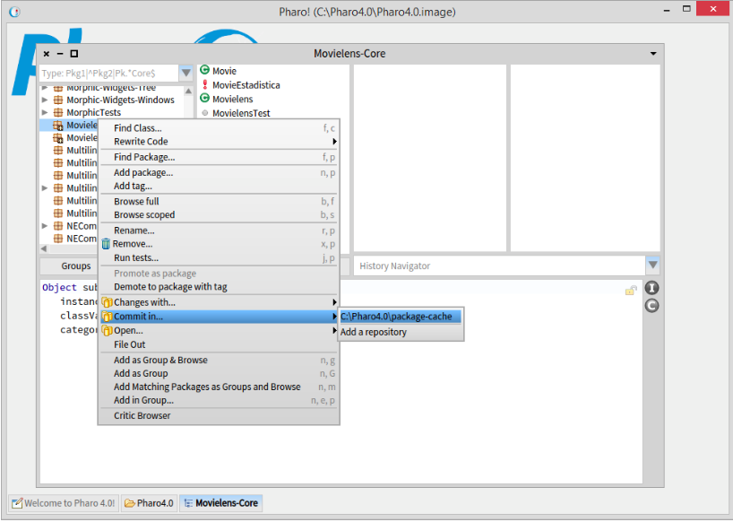
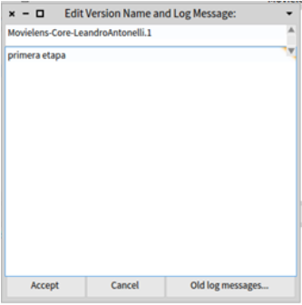
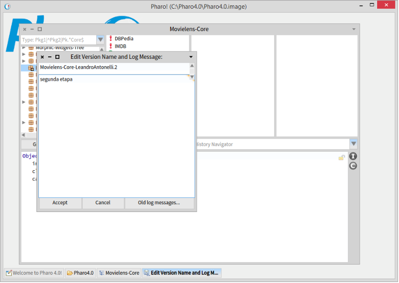
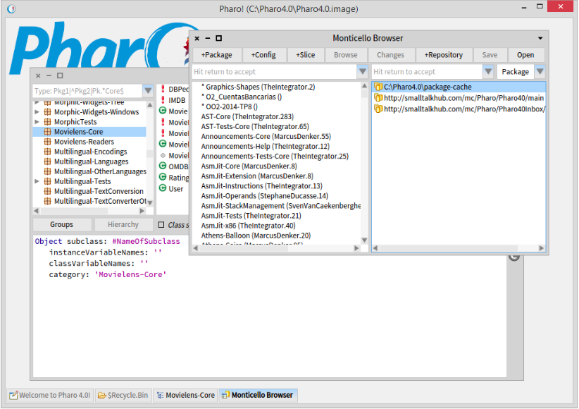
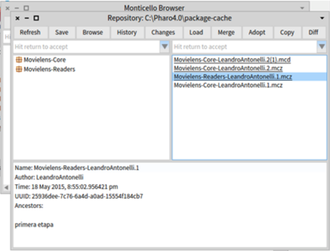

Promoción Objetos 2 - 2015 - 2da etapa
======================================

Esta etapa consiste en extender el diseño y la implementación realizada para
incluir 2 nuevos requerimientos. Por favor lea atentamente los requerimientos y
la lista de tareas.

1. El sistema debe enriquecer la información de las películas provista en los
   archivos con información que obtiene de otras fuentes de datos (otros sites
   similares a OMDB, como por ejemplos themoviedb).

  1. Se pueden combinar varias fuentes: themoviedb -> dbpedia -> imdb ->
     datosDelArchivoLocal. El orden establecido indica que si un mismo dato
     está disponible en varias fuentes se prefiere en primer lugar el de
     themoviedb, si allí no está, se utilizará el dato de dbpedia, si allí no
     está el de imdb, y así sucesivamente hasta que se encuentre o hasta
     determinar que no existe.

  2. La información de cada fuente nueva no debe sobre escribir la existente.
     Es decir, no se debe perder la información original de la película (la que
     se obtiene del archivo). Además, la información de un site como themoviedb
     no debe sobre escribir la imdb, ni viceversa.

  3. El usuario de la aplicación debe poder elegir si activa o no la
     funcionalidad de enriquecer, y de cuales sitios y en que orden.

  4. Debe considerar las siguientes fuentes: themoviedb , dbpedia y imdb. Sin
     embargo, a futuro se puede agregar nuevas como por ejemplo freebase.

  5. A partir de una misma combinación puede tener distintos órdenes: (i)
     dbpedia -> imdb -> datosDelArchivoLocal y (ii) imdb -> dbpedia ->
     datosDelArchivoLocal, obteniendo resultados distintos entre (i) y (ii).
     Tenga en cuenta que los datos del archivo locales son siempre el último
     recurso

  6. No se debe ensuciar la clase película con temas de proveedores de datos
     adicionales

  7. No se completa los datos adicionales hasta que se solicita algún dato de
     la película. Pero cuando se va a buscar un dato adicional, se recuperan
     todos los datos (lazy por película, pero no por atributo).

2. El sistema debe permitir implementar varios mecanismos de recomendacion de
   peliculas:

  1. Un mecanismo similar al implementado en el primer enunciado pero las
     peliculas deben ser ordenadas por antigüedad (las más antiguas primero).

  2. Otro mecanismo que recomiende aquellas peliculas que fueron evaluadas por
     2 o más amigos con puntaje 3 o superior, ordenadas por el rating de IMDB.

  3. Finalmente, recomendar aquellas películas con mayor rating promedio, que
     al menos un amigo haya evaluado.

Para diseñar los mecanismos de recomendación considere que:

  1. En el futuro se podrán agregar nuevos métodos de recomendación.
  2. Solo un método de sugerencia puede estar activo.
  3. El método de sugerencia debe poder ser cambiado dinámicamente.
  4. El usuario determina arbitrariamente que método de sugerencia quiere
     utilizar

Tareas
======

1. Diseñe la aplicación para considerar los requerimientos indicados.

  1. Antes de aplicar un patrón de diseño lea atentamente su sección
     "applicability"
  2. Para cada requerimiento indique explícitamente qué ítems de la
     applicability del patrón coinciden con restricciones impuestas en los
     requerimientos.
  3. Para cada requerimiento y patrón indique cuáles de los ítems de la
     applicability NO se cumplen para el problema en cuestión.
  4. Utilice estereotipos UML para documentar los roles de cada clase en el
     patrón.

2. Implemente:

  1. Es posible que en este punto debe realizar refactorings antes de comenzar
     la implementación. Indique qué refactorings aplicó. (Guarde ambas
     versiones del código, para mostrar al ayudante..)
  2. Escriba los test cases correspondientes a los nuevos algoritmos de
     recomendación.
  3. Implemente la solución.
  4. Ejecute el test case que implementó en esta etapa y en la etapa previa,
     para verificar que la nueva implementación no " rompió" la implementación
     de recomendación de la etapa 1 y que las nuevas recomendaciones funcionan
     correctamente.

Nota: Considere la siguiente guía para poder llevar al visado las dos versiones
del código.

  > Solucion:
  [Movielens](src/promocion/Movielens.st)

1. Guardado de la versión inicial (la del primer visado): Elija cada uno de los
   paquetes de la versión inicial y ejecute "commit in..."

   

   Ingrese un nombre de la versión

   

2. Guardado de la versión del segundo visado: Escriba el código necesario y
   vuelva a utilizar la operación `commit` para guardar la segunda versión.
   Verifique que independiente del nombre descriptivo que elija para esta
   segunda versión, se registra como ".2"

   

3. Recuperación de las distintas versiones: Acceda a `Monticello Browser` y
   elija el repositorio correspondiente. Alli elija `open`.

   

   En el browser del repositorio, elija la versión que le interese y luego
   presione `Load`. De esta forma, Pharo posee la versión del trabajo que le
   interesa.

   

4. Transportar el código a otra imagen: Para ello, necesita trasladar los
   archivos .mc\* que se ubican en la carpeta "C:\Pharo4.0\package-cache" (o el
   repositorio que posea).
