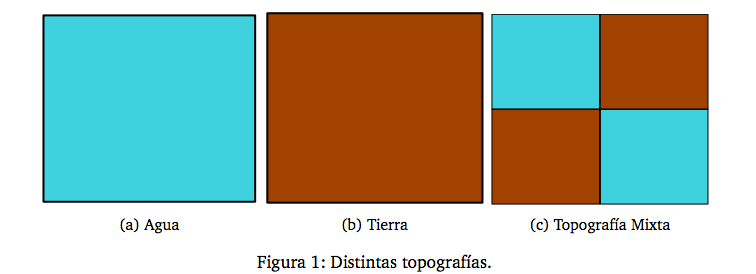

Orientación a Objetos 2 – Práctica 2
====================================

Ejercicio 3: Topografía
-----------------------

Un objeto Topografía representa la distribución de agua y tierra de una región
cuadrada del planeta, la cual está formada por porciones de “agua” y de
“tierra”. La figura 1a muestra el aspecto de una topografía formada únicamente
por agua, otra formada sólamente por tierra (fig. 1b) y una topografía mixta
(fig. 1c).

Una topografía mixta está formada por partes de agua y partes de tierra (4
partes en total). Éstas a su vez podrían descomponerse en 4 más y así
consecutivamente.

<!--  -->

Como puede verse en los ejemplos, hay una relación muy estrecha entre la
proporción de agua o tierra de una topografía mixta y la proporción de agua o
tierra de sus componentes (compuestas o no). Por ejemplo:

  - La proporción de agua de una topografía sólo agua (fig. 1a) es 1.
  - La proporción de agua de una topografía sólo tierra (fig. 1b) es 0.
  - La proporción de agua de una topografía compuesta está dada por la suma de
    la proporción de agua de sus componentes dividida por 4.

En la figura 1c, la proporción de agua es: 0 + 1/4 + 1/4 + 0 = 1/2. La
proporción siempre es un valor entre 0 y 1.

1. Implemente las clases necesarias para que sea posible:

  - crear Topografías
  - calcular su proporción de agua y tierra
  - comparar igualdad entre topografías (dada por igual proporción de agua y
    tierra e igual distribución).

2. Instancie la topografía compuesta del ejemplo y pruebe la funcionalidad
implementada mediante test cases.

> Nota: sólo se descomponen topografías para conseguir combinaciones. No es
> correcto construir una topografía compuesta por cuatro topografías del mismo
> tipo.
