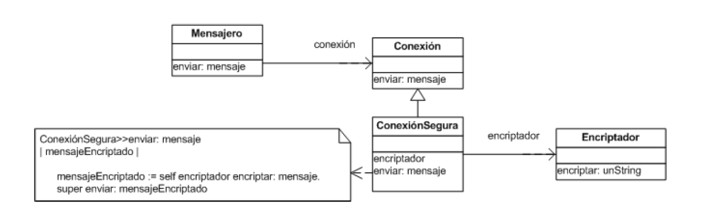

Orientacio a Objetos 2 - Pratica 4
==================================

Ejercicio 1: Juego de Combate con Taticas
------------------------------------------

Retomando el ejercicio del Juego de Combate, ahora se desea dotar a los
jugadores de taticas de combate. Las taticas disponibles son:

 - *Agresiva*: en donde se utilizaraun 80 % de golpes y un 20 % de bloqueos
     elegidos de forma aleatoria.
 - *Random*: en donde la eleccio del movimiento seraaleatorio con la misma
     probabilidad para los golpes y los bloqueos.
 - *Defensiva*: en donde la cantidad de bloqueos serade 80 % y la cantidad de
     golpes de 20, elegidos de forma aleatoria. %.
 - *Golpe-Bloqueo*: en esta estrategia el jugador comienza con un golpe y
     continua con un bloqueo, repitiendo siempre esta secuencia.

Un jugador utiliza una tatica durante todo un combate, pero puede cambiar de
tatica entre combates. Por ejemplo,si un jugador pierde al utilizar la tatica
random, puede decidir usar la defensiva.

   1. Realice un diagrama de clases.
   2. Implemente en Smalltalk.
   3. Ejecute 100 corridas de todas las taticas contra el resto y averigue
      que tatica es la ma exitosa.

Ejercicio 2: El Encriptador
---------------------------

En un sistema de mensajes instantaeos (como Gtalk), se envin mensajes de una
mauina a otra a trave de una red. Para asegurar que la informacio que pasa
por la red no es espiada, el sistema utiliza una conexio segura. Este tipo de
conexio encripta la informacio antes de enviarla y la desencripta al recibirla.
La siguiente figura ilustra un posible diseño para este enunciado.

Figura 1: Diseño del encriptador

El encriptador utiliza el algoritmo RSA, pero se desea agregar otros algoritmos
(diferentes algoritmos ofrecen distin- tos niveles de seguridad, overhead en la
transmisio, etc).

   1. Modifique el diseño para que el objeto Encriptador pueda encriptar
      mensajes usando los algoritmos Blowfish y RC4, adema del ya soportado
      RSA.

   2. Documente mediante un diagrama de clases UML indicando los roles de cada
      clase.

Ejercicio 3: Sensores de temperatura
------------------------------------

Un automoil tiene un dispositivo de sensado que mide la temperatura en
varios lugares del motor. El sistema de software que controla al motor
implementa el registro de esas medidas como una instancia de la clase
`RegistroDeTemperaturas`, que entiende los siguientes mensajes:

`#temperaturaDelCarter`
`#temperaturaDelCombustible`
`#temperaturaDeEscape`
`#reset`

Los valores de temperatura retornados por los primeros tres mensajes esta
expresados en centeimas de grados Fahrenheit (es decir, un valor de retorno de
3200 indica una temperatura de 32,0F).

El mensaje #reset re-inicializa el registro y se usa en casos en los que se
desconfi del funcionamiento correcto del registro (algo asicomo un reboot).

Se desea implementar una serie de extensiones al registro con los siguientes
requerimientos:

    * No se puede modificar la implementacio de la clase RegistroDeTemperatura

    * Cada una de las extensiones es independiente de las dema y debe ser
      posible activarla o desactivarla en tiempo de ejecucio.

    * Un objeto que interactuaba con un RegistroDeTemperatura, debe poder
      interactuar sin necesidad de cambios en su implementacio con un
      registro al que se han aplicado las extensiones.

A continuacio se detallan las extensiones que se desean implementar:

   1. Traducir los valores retornados por el registro: se desea retornar los
      valores en grados Celsius (La conversion es C=(F-32)/1.8)

   2. Corregir el rango: se desea que antes de retornar el valor sensado, el
      sistema lo multiplique por un valor provisto en el momento de la
      configuracio. Por ejemplo, multiplicar por 0,01 para permitir la
      obtencio de valores en grados Farenheit en lugar de centeimas.

   3. Agregar mensajes que permitan obtener el valore miimo y el maimo para
      cada temperatura, computando desde el utimo #reset.

Tarea:

   1. Realice el diseño de la aplicacio con las extensiones solicitadas y
      represetelo con un diagrama UML de clases.

   2. Realice los diagramas de secuencia UML que muestren la colaboracio del
      RegistroDeTemperatura con las extensiones para el siguiente caso: se
      desea que los valores de retorno se expresen grados Celsius y con un
      rango corregido usando centeimas.

   3. Implemente en forma completa en Smalltalk.

   4. Implemente y ejecute test cases para probar cada extensio en forma
      aislada.
