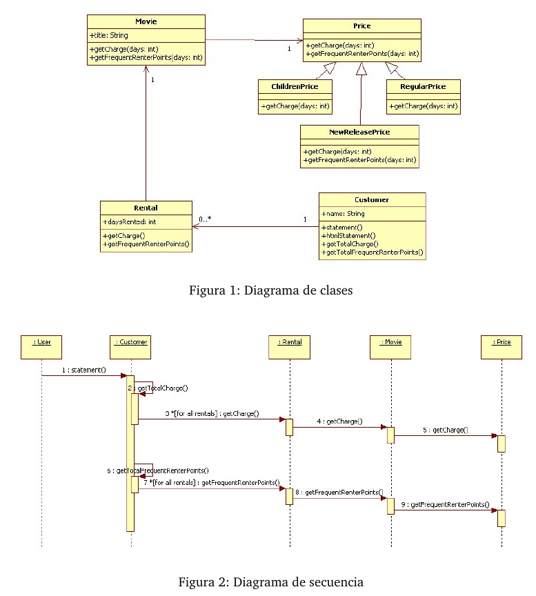

Orientación a Objetos 2 -Práctica 6
====================================


Ejercicio 1: Testee, revise y proponga mejoras a un código existente
-------------------------------------

Cargue el código sobre las cuentas bancarias que se adjunta en el material adicional de la práctica y realice las
siguientes tareas:


1. Ejecute test cases incluidos para comprobar que:


  - De una caja de ahorro se puede extraer montos menores o iguales al saldo.
  - El saldo se actualiza correctamente cuando se realiza un depósito.
  - De una cuenta corriente se puede extraer hasta alcanzar el rojo permitido.
  

2. Examine el código provisto en la clase CuentaBancaria y describa los problemas de diseño y/o codificación
que encuentre. Sugiera un diseño mejorado y aplique todos los cambios necesarios al código para implementar
su diseño.


3. Actualice los test cases para que funcionen con el código corregido y ejecútelos para comprobar que el modelo
continúa comportándose correctamente.


4. Discuta con el ayudante sobre cuál es la importancia de los test cases cuando se hace refactoring. Escriba su
conclusión.


Ejercicio 2: Un poco más de refactoring
-------------------------------------


En un sistema existen vendedores, representados por instancias de la clase Salesman. Estos vendedores realizan ventas, que son objetos de la clase Sale, que a su vez tienen un monto (responden al mensaje `#amount`) y pueden estar cobradas o pendientes (responden a `#pending`, que retorna un Boolean). Un vendedor sabe decir cuánto dinero le queda por cobrar (`#pendingMoney`) y también sabe decir cuántas ventas pendientes tiene (`#pendingSalesNumber`).
Los métodos `#pendingMoney` y `#pendingSalesNumber` han sido implementados de la siguiente manera:


```
Salesman >> pendingMoney
  | ps tot |
  ps := sales select:[:s | s pending].
  tot := 0.
  ps do: [ :s2 | tot := tot + s2 amount.].
  ^tot
  
  Salesman >> pendingSalesNumber
    | ps |
    ps := sales select:[:s | s pending].
    ^ps size
```

En el material adicional de la práctica encontrará la implementación de las clases mencionadas y los test cases para verificar el funcionamiento.


Tareas

  - Refactorice los métodos de la clase Salesman.
  - Compruebe que la funcionalidad sigue intacta corriendo los tests con el código modificado.


Ejercicio 3: Video Club
-------------------------------------


Lea atentamente los siguientes diagramas y métodos:



```
>>statement
  | result |
  result := ’Rental Record for’ , self name , Character cr.
  rentals do: [ :aRental |result := result , aRental movie title , ’ ’ ,aRental charge , Character cr.].
  result := result, ’Amount owed is ’, self totalCharge , Character cr.
  result := result,’You earned ’ , self totalFrequenRenterPoints ,’ frequent renter points.’.
  ^ result

>>htmlStatement
  | result |
  result := ’<H1>Rentals for <EM>’ , self name , ’ </EM></H1><P> ’ , Character cr.
  rentals do: [ :aRental | result := result , aRental movie title , ’: ’ , aRental charge ,’<BR>’, Character cr.].
  result := result, ’<P>You owe <EM> ’, self totalCharge , ’</EM><P>’ ,Character cr.
  result := result,’ On this rental you earned <EM> ’ , self totalFrequenRenterPoints , ’ </EM> frequent renter points<P>’.
  ^ result
```

Tareas:


1. Refactorice los métodos `#statement` y `#htmlStatemen`t para mejorar el diseño.
Utilice como base el código que se entrega en el material adicional de la práctica. Antes de hacer cambios,
verifique que el código original (que responde a los diagramas y texto del enunciado) pasa exitosamente los
testCases incluidos. Luego haga las modificaciones que se piden al diseño e implemente los cambios al código
para responder a su nuevo diseño.

2. Verifique que el nuevo código también pasa exitosamente los mismos tests.

3. Documente los pasos de refactoring aplicados indicando las técnicas de refactorings que utiliza.


Ejercicio 4:
-------------------------------------

Considere código escrito por ud. puede pertenecer a prácticas anteriores o a Objetos 1.

  - Identifique smells.
  - Seleccione 2 smells que desea eliminar y escriba los test cases para el código que va refactorizar.
  - Refactorice y verifique que el programa refactorizado sigue pasando los tests.


